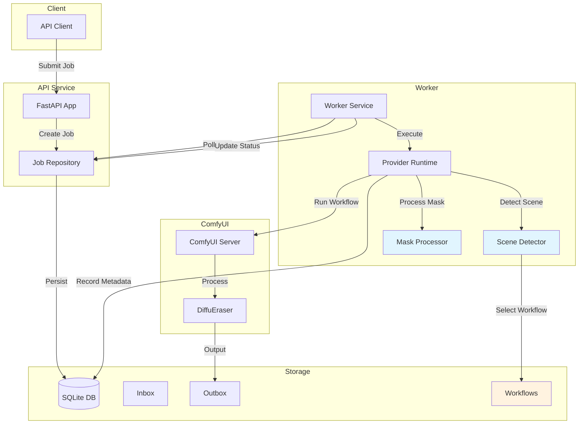
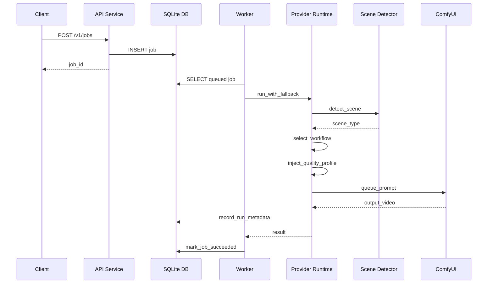

# 去水印平台改进计划 - 详细执行方案

## 概述

本文档基于 [`plans/improvement_plan.md`](plans/improvement_plan.md) 制定详细执行方案，将改进计划分解为可执行的任务步骤。

## 当前架构分析

### 核心文件

| 文件 | 职责 |
|------|------|
| [`src/wm_platform/provider_runtime.py`](src/wm_platform/provider_runtime.py) | Provider 执行逻辑，包括 ComfyUI 和 local_fallback |
| [`src/wm_platform/config.py`](src/wm_platform/config.py) | 配置管理，从环境变量加载设置 |
| [`src/wm_platform/repository.py`](src/wm_platform/repository.py) | 数据访问层，操作 SQLite 数据库 |
| [`src/wm_platform/models.py`](src/wm_platform/models.py) | Pydantic 数据模型定义 |
| [`src/wm_platform/worker_service.py`](src/wm_platform/worker_service.py) | Worker 服务，处理 job 执行和回调 |
| [`workflows/sam2_diffueraser_api.json`](workflows/sam2_diffueraser_api.json) | 基线 ComfyUI workflow |

### 当前 Workflow 参数

基线 workflow [`sam2_diffueraser_api.json`](workflows/sam2_diffueraser_api.json:1) 的关键参数：
- `steps`: 2
- `video_length`: 10
- `mask_dilation_iter`: 2
- `ref_stride`: 10
- `neighbor_length`: 10
- `subvideo_length`: 50

---

## 阶段一：P0 - 基线和可观测性

### 任务 1.1：建立评测集目录结构

**目标**：创建评测集目录，用于系统化测试不同场景

**执行步骤**：

1. 创建目录结构：
   ```
   plans/eval_dataset/
   ├── simple/          # 简单场景：固定角标、小面积水印
   ├── medium/          # 中等场景：移动水印、中等面积
   ├── hard/            # 复杂场景：大面积、半透明、动态
   └── README.md        # 评测集使用说明
   ```

2. 在 `README.md` 中说明：
   - 各目录用途
   - 测试视频要求
   - 如何运行评测
   - 如何记录结果

**涉及文件**：
- 新建 `plans/eval_dataset/simple/`
- 新建 `plans/eval_dataset/medium/`
- 新建 `plans/eval_dataset/hard/`
- 新建 `plans/eval_dataset/README.md`

---

### 任务 1.2：创建新 Workflow 文件

**目标**：基于基线 workflow 创建不同质量档位的 workflow

**执行步骤**：

1. **`sam2_diffueraser_balanced.json`** - 平衡档
   - 从基线复制
   - 调整参数：
     - `steps`: 4-6
     - `subvideo_length`: 60-80
     - `neighbor_length`: 12-16
     - `mask_dilation_iter`: 2-3

2. **`sam2_diffueraser_quality.json`** - 质量档
   - 从基线复制
   - 调整参数：
     - `steps`: 6-8
     - `subvideo_length`: 80-120
     - `neighbor_length`: 16-24
     - `mask_dilation_iter`: 3-4

3. **`corner_watermark_hq.json`** - 角标专用
   - 针对固定角标场景优化
   - 可能需要调整：
     - 更小的 `subvideo_length`（角标通常稳定）
     - 更高的 `steps`（追求质量）
     - 特定的 mask 处理参数

**涉及文件**：
- 新建 `workflows/sam2_diffueraser_balanced.json`
- 新建 `workflows/sam2_diffueraser_quality.json`
- 新建 `workflows/corner_watermark_hq.json`

---

### 任务 1.3：增加运行元数据记录

**目标**：记录每次运行的参数，便于后续分析和对比

**执行步骤**：

1. **数据库扩展** - 在 [`repository.py`](src/wm_platform/repository.py:1) 中：
   - 新增 `run_metadata` 表（在 [`db.py`](src/wm_platform/db.py:21) 的 SCHEMA 中添加）
   - 字段：
     - `id` (INTEGER PRIMARY KEY)
     - `job_id` (TEXT)
     - `workflow_name` (TEXT)
     - `quality_profile` (TEXT)
     - `steps` (INTEGER)
     - `subvideo_length` (INTEGER)
     - `neighbor_length` (INTEGER)
     - `mask_dilation_iter` (INTEGER)
     - `device` (TEXT)
     - `seed` (INTEGER)
     - `created_at` (TEXT)

2. **Provider 层** - 在 [`provider_runtime.py`](src/wm_platform/provider_runtime.py:1) 中：
   - 在 `_ComfyDiffuEraserProvider.run()` 方法中收集运行参数
   - 在任务完成后记录元数据

3. **Repository 层** - 在 [`repository.py`](src/wm_platform/repository.py:1) 中：
   - 新增 `record_run_metadata()` 方法
   - 新增 `get_run_metadata()` 查询方法

**涉及文件**：
- `src/wm_platform/db.py` - 新增表结构
- `src/wm_platform/repository.py` - 新增方法
- `src/wm_platform/provider_runtime.py` - 收集元数据

---

### 任务 1.4：增加 quality profile 注入逻辑

**目标**：支持在运行时动态注入 quality profile 参数到 workflow

**执行步骤**：

1. 在 [`provider_runtime.py`](src/wm_platform/provider_runtime.py:1) 中：
   - 定义 quality profile 配置结构
   - 在 `_build_prompt()` 方法中注入 quality profile 参数
   - 在 `_inject_prompt_runtime_values()` 中处理参数覆盖

2. Quality Profile 配置示例：
   ```python
   QUALITY_PROFILES = {
       "fast": {
           "steps": 2,
           "subvideo_length": 50,
           "neighbor_length": 10,
           "mask_dilation_iter": 1,
       },
       "balanced": {
           "steps": 5,
           "subvideo_length": 70,
           "neighbor_length": 14,
           "mask_dilation_iter": 2,
       },
       "quality": {
           "steps": 7,
           "subvideo_length": 100,
           "neighbor_length": 20,
           "mask_dilation_iter": 3,
       },
   }
   ```

**涉及文件**：
- `src/wm_platform/provider_runtime.py`

---

## 阶段二：P1 - 角标场景优先和 Mask 稳定性

### 任务 2.1：增加角标场景判定规则

**目标**：自动识别简单固定角标场景，切换到专用 workflow

**执行步骤**：

1. 在 [`provider_runtime.py`](src/wm_platform/provider_runtime.py:1) 中新增场景检测逻辑：
   - 分析输入视频的前几帧
   - 检测水印位置（是否在四角）
   - 检测水印面积（是否较小，如 < 5% 画面）
   - 检测多帧位置稳定性（位置变化是否小）

2. 场景判定规则：
   - **角标场景**：位于四角 + 面积 < 5% + 位置稳定
   - **简单场景**：面积 < 10% + 位置相对稳定
   - **复杂场景**：其他情况

3. Workflow 选择逻辑：
   ```python
   def select_workflow(job, scene_type):
       if scene_type == "corner":
           return "corner_watermark_hq.json"
       elif scene_type == "simple":
           return "sam2_diffueraser_balanced.json"
       else:
           return "sam2_diffueraser_api.json"  # 基线
   ```

**涉及文件**：
- `src/wm_platform/provider_runtime.py`
- `workflows/corner_watermark_hq.json`

---

### 任务 2.2：增加 Mask 时序平滑

**目标**：减少 mask 在时间维度上的抖动

**执行步骤**：

1. 在 [`provider_runtime.py`](src/wm_platform/provider_runtime.py:1) 中新增 mask 后处理：
   - **面积变化阈值限制**：相邻帧 mask 面积变化不超过 30%
   - **中心点漂移阈值限制**：相邻帧 mask 中心点移动不超过 50 像素
   - **小面积离散区域过滤**：过滤面积 < 100 像素的孤立区域

2. 实现方式：
   - 在 ComfyUI workflow 中添加后处理节点（如果支持）
   - 或在 Python 代码中对 mask 序列进行处理

**涉及文件**：
- `src/wm_platform/provider_runtime.py`
- 可能需要修改 workflow 文件

---

### 任务 2.3：增加 Mask 合法性检查

**目标**：检测异常 mask，避免误擦主体内容

**执行步骤**：

1. 在 [`provider_runtime.py`](src/wm_platform/provider_runtime.py:1) 中新增检查：
   - **区域面积过大**：mask 面积 > 30% 画面 -> 警告
   - **多个分散区域**：mask 连通域数量 > 3 -> 警告
   - **跨帧跳动过大**：相邻帧 mask IoU < 0.5 -> 警告

2. 低置信度处理：
   - 记录警告信息到运行元数据
   - 切换到保守参数（更小的处理区域）
   - 或标记为需要人工审核

**涉及文件**：
- `src/wm_platform/provider_runtime.py`
- `src/wm_platform/repository.py` - 记录警告信息

---

## 阶段三：P1.5 - 参数分档

### 任务 3.1：增加质量档位配置

**目标**：支持通过环境变量切换质量档位

**执行步骤**：

1. 在 [`config.py`](src/wm_platform/config.py:1) 中：
   - 新增 `DWM_QUALITY_MODE` 配置项
   - 默认值：`balanced`
   - 可选值：`fast`, `balanced`, `quality`

2. 在 [`provider_runtime.py`](src/wm_platform/provider_runtime.py:1) 中：
   - 根据 quality mode 选择对应的 workflow 文件
   - 根据 quality mode 应用对应的参数覆盖

3. 参数调优顺序：
   1. `steps` - 影响生成质量
   2. `mask_dilation_iter` - 影响 mask 大小
   3. `subvideo_length` - 影响处理窗口
   4. `neighbor_length` - 影响参考帧数量
   5. `ref_stride` - 影响参考帧采样

**涉及文件**：
- `src/wm_platform/config.py`
- `src/wm_platform/provider_runtime.py`

---

## 阶段四：P2 - 基础后处理

### 任务 4.1：增加基础后处理

**目标**：改善输出视频的视觉质量

**执行步骤**：

1. **修补区域和原视频的轻量混合**：
   - 在修补区域边缘进行 alpha 混合
   - 混合比例：修补区域 80% + 原视频 20%

2. **边缘 feather**：
   - 在 mask 边缘应用高斯模糊（半径 2-3 像素）
   - 使修补区域边缘更自然

3. **局部锐化开关**：
   - 提供配置项控制是否启用锐化
   - 锐化强度可配置

4. **基础闪烁抑制**：
   - 检测相邻帧亮度差异
   - 对差异过大的帧进行平滑处理

**涉及文件**：
- `src/wm_platform/provider_runtime.py`
- 可能需要修改 workflow 文件添加后处理节点

---

## 阶段五：测试补充

### 任务 5.1：补充测试用例

**目标**：为新增功能添加测试覆盖

**执行步骤**：

1. **Quality Profile 测试**：
   - 测试不同 quality profile 的参数注入
   - 测试 profile 切换后的输出差异

2. **Workflow 选择测试**：
   - 测试不同场景类型对应的 workflow 选择
   - 测试 workflow 文件不存在时的降级处理

3. **低置信度 case 分流测试**：
   - 测试 mask 合法性检查的触发
   - 测试低置信度时的保守处理逻辑

4. **质量档位切换测试**：
   - 测试 `DWM_QUALITY_MODE` 环境变量的影响
   - 测试各档位的参数记录一致性

**涉及文件**：
- `tests/test_api_workflow.py`

---

## 文件变更汇总

### 新增文件

| 文件 | 说明 |
|------|------|
| `plans/eval_dataset/simple/` | 简单场景评测集目录 |
| `plans/eval_dataset/medium/` | 中等场景评测集目录 |
| `plans/eval_dataset/hard/` | 复杂场景评测集目录 |
| `plans/eval_dataset/README.md` | 评测集使用说明 |
| `workflows/sam2_diffueraser_balanced.json` | 平衡档 workflow |
| `workflows/sam2_diffueraser_quality.json` | 质量档 workflow |
| `workflows/corner_watermark_hq.json` | 角标专用 workflow |

### 修改文件

| 文件 | 修改内容 |
|------|----------|
| `src/wm_platform/db.py` | 新增 `run_metadata` 表结构 |
| `src/wm_platform/config.py` | 新增 `DWM_QUALITY_MODE` 配置 |
| `src/wm_platform/repository.py` | 新增元数据记录方法 |
| `src/wm_platform/provider_runtime.py` | 新增 workflow 选择、quality profile 注入、场景检测、mask 处理 |
| `src/wm_platform/models.py` | 新增运行元数据模型 |
| `tests/test_api_workflow.py` | 新增相关测试用例 |

---

## 系统架构图



---

## 数据流图



---

## 验收标准

### P0 验收

- [ ] 评测集目录创建完成
- [ ] 能跑通评测集
- [ ] 能记录每次运行参数
- [ ] 能对比不同 workflow 的输出差异

### P1 验收

- [ ] 固定角标场景成功率明显提升
- [ ] 明显误擦 case 下降
- [ ] 闪烁和边缘跳动下降

### P1.5 验收

- [ ] 支持 `fast / balanced / quality` 三档切换
- [ ] 档位切换后输出和参数记录一致

### P2 验收

- [ ] 输出边缘更自然
- [ ] 局部闪烁减少
